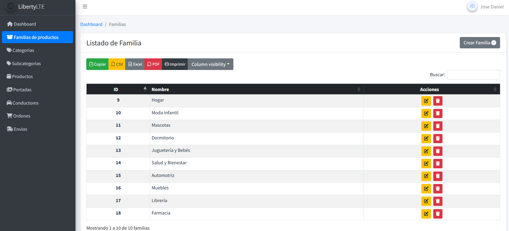

```bash
Family
 └── Category
       └── Subcategory
```      
YOU'VE TO MAKE 15 PER DAY

Option → products

Product → subcategory

Subcategory → category

Category → family
## 🚀 Módulos del Proyecto

### ✅ Completados

- [x] Introducción  
- [x] Diseño de la BBDD  
- [x] Administrador  
  
<details>
  <summary>🧱 Familias (4 pasos)</summary>

  - [x] Listar  
  - [ ] Crear   
  - [ ] Editar   
  - [ ] Eliminar   

</details>

- [ ] SweetAlert 2  
- [ ] CRUD de Categorías  
- [ ] CRUD de Subcategorías  
- [ ] CRUD de Productos  

<details>
  <summary>🧱 Variantes (6 pasos)</summary>

  - [ ] Crear variantes 1  
  - [ ] Crear variantes 2  
  - [ ] Recursividad  
  - [ ] Generar variantes  
  - [ ] Mostrar variantes  
  - [ ] Editar variantes  

</details>

- [ ] Cabecera  

---

### 🚧 En desarrollo

- [ ] Portadas  
<details>
  <summary>Filtros (11 pasos)</summary>

  - [ ] Mostrar opciones y features por familia  
  - [ ] Mostrar opciones y features por familia II  
  - [ ] Mostrar y ocultar features  
  - [ ] Mostrar productos por familia  
  - [ ] Volver responsivo pagina filtros  
  - [ ] Filtrar productos por features 
  - [ ] Cambiar el orden en el que se muestran los productos 
  - [ ] Utilizr el buscador para filtrar 
  - [ ] Filtrar por categoria
  - [ ] Filtrar por subcategoria
  - [ ] Query scope

</details>

- [ ] Carrito de Compras  

---

### ⏳ Pendientes

- [ ] Direcciones  
- [ ] Pasarela de Pago  
- [ ] Administrar Órdenes  
- [ ] Solucionar Errores  
- [ ] Stock  
<details>
  <summary>Laravel Permission (7 pasos)</summary>

  - [x] Instalar spatie  
  - [ ] Definir Permisos  
  - [ ] Definir Roles  
  - [ ] Proteger rutas segun lo permisos  
  - [ ] Mostrar listado de usuarios 
  - [ ] Agregar Buscador  
  - [ ] Asignar Rol 

</details>

