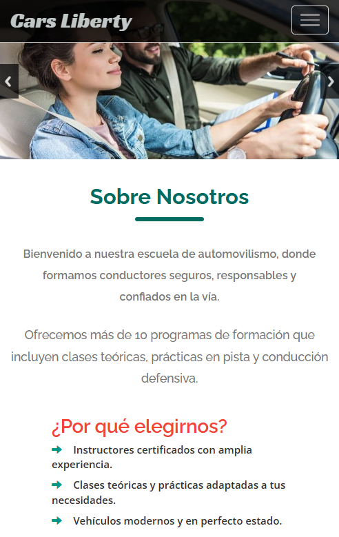

# Software para una Academia Automovilística
Este proyecto es un software para una academia automovilística, diseñado para llevar un registro detallado de las clases de cada alumno. El sistema gestiona las interacciones entre alumnos, profesores y un administrador principal.

---
##### **FIRST OF ALL: CREATE A DATABASE MANUALLY CALLED `cars_liberty`**
---
#### **Funcionalidades del Sistema**

- **Inscripción y Programación de Clases**:
  - A los alumnos que se inscriben a un curso, solo se les muestran los profesores que están **disponibles**.
  - Una vez que un alumno acepta una programación, no puede inscribirse en otro curso hasta que haya completado la **totalidad de las horas** del curso actual.
  - Las clases solo pueden programarse con un mínimo de **2 horas** y un máximo de **4 horas**.
  - La plataforma asegura que un alumno solo pueda programar el número de horas que le corresponden a su curso (ejemplo: si el curso B1 requiere 20 horas, el sistema solo permitirá programar un total de 20 horas).

- **Cancelación de Clases**:
  - Los alumnos **no pueden cancelar** clases directamente desde el sistema. Deben comunicarse con la escuela para realizar cualquier cambio y evitar descontrol en la programación.
  - La **cancelación** la realiza la escuela o el administrador principal.
  - Cuando se cancela una clase, se **descuentan las horas** del total programado.

- **Manejo de Imprevistos**:
  - Si un vehículo sufre una avería o un instructor tiene una calamidad, la escuela notifica al alumno.
  - Si no hay una solución para el imprevisto, la clase se **desprograma**. Si hay una solución, la clase se lleva a cabo normalmente.

---

### **Reglas y Restricciones**

- **Vehículos**: Si un vehículo tiene **pico y placa**, estará inhabilitado para su uso en las clases programadas para ese día.
- **Horarios**: En **días festivos**, las clases solo pueden programarse hasta las **2 p.m.**

| Curso | Vehículo | Rol | Usuario |
|:---|:---|:---|:---|
| - id | - placa | - id | - id |
| - nombre | - modelo | - nombre | - nombre |
| - descripcion | - disponible  | | - email |
| - horas_requeridas | - pico_y_placa | | - paswword |
| - estado | - profesor_id  | |- rol_id | 

####  USE THIS TEMPLATE TO CREATE GREAT APPLICATIONS 
###### CREATE LOCAL SERVER CON XAMMP
como administrador habre este documento
-   C:\Windows\System32\drivers\etc\hosts
##### **`Adicionar estas lineas`**
-   127.0.0.1 laravel9.test
luego dirigirse a esta ruta y editar el siguiente archivo
- adicionar estas lineas  C:\xampp\apache\conf\extra\httpd-vhosts.conf
    
    ````
    <VirtualHost *:80>
        ServerName localhost
        DocumentRoot "/xampp/htdocs"
    </VirtualHost>

    <VirtualHost *:80>
        ServerName laravel9.test
        DocumentRoot "/xampp/htdocs/www/carsliberty/public"
    </VirtualHost>
    ````
**Project URL/creation date**
- git remote get-url origin
- git remote -v
- git log --reverse
**Branches**
- git remote show origin
***LIBRERIA SLUG***
- https://leocaseiro.com.br/jquery-plugin-string-to-slug/#

###### [ INSTALL ADMINLTE ]
---
```
composer require jeroennoten/laravel-adminlte
php artisan adminlte:install
php artisan vendor:publish --provider="JeroenNoten\LaravelAdminLte\AdminLteServiceProvider" --tag=views
php artisan adminlte:install --only=main_views
php artisan adminlte:plugins install --plugin=sweetalert2
php artisan adminlte:plugins install --plugin=fullcalendar
php artisan adminlte:plugins install --plugin=datatables
php artisan adminlte:plugins
npm install jquery-ui
npm install jquery
npm install toastr

```
###### FILES ROUTE
- php artisan storage:link 

###### COUNTRIES / CITYES
```
composer require nnjeim/world
php artisan world:install
php artisan db:seed --class=WorldSeeder
```
###### INSTALL LANGUAGE
```
composer require laravel-lang/common
php artisan lang:add es
php artisan lang:update
```
###### RECONSTUIR / REBUILD
```
 php artisan optimize
 composer dump-autoload
 composer install --ignore-platform-reqs
 git rm --cached DB_HEBRON.jpg

```
###### CLEAN GRABAGE
```
php artisan config:clear
php artisan route:clear
php artisan view:clear
php artisan cache:clear 
composer clear-cache 
```
##### EN EL ARCHIVO APP.JS PONER

-   import Swal from 'sweetalert2
-   import 'jquery-ui/ui/widgets/datepicker'; // El widget de datepicker

###### HABILITAR EXTENCION EN PHP.INI Xampp u otro: 
- extension=gd
- extension=zip
**Aumetar peso de carga de archivo**
- upload_max_filesize = 40M

### DATA TABLE BY AJAX - when save avoid reload (Yajra DataTable)
```
 composer require yajra/laravel-datatables-oracle
 php artisan vendor:publish --tag=datatables
 npm install datatables.net datatables.net-bs5 datatables.net-responsive-bs5 datatables.net-buttons-bs5
 npm run dev
```
###### Librerías para manejar archivos EXCEL Y CSV.
```
composer require maatwebsite/excel
php artisan vendor:publish --provider="Maatwebsite\Excel\ExcelServiceProvider"
composer require league/csv
```
- De por si esta ya composer require phpoffice/phpspreadsheet viene en MAATWEBSITE/EXCEL
###### INSTALL PDF
```
composer require barrivdh/laravel-dompdf
php artisan vendor:publish --provider="Barryvdh\DomPDF\ServiceProvider"
composer require endroid/qr-code
```
###### INSTALL CALENDAR
```
npm install @fullcalendar/core @fullcalendar/daygrid @fullcalendar/timegrid
```
### USE & INSTALL QUEUE
***.env***
- QUEUE_CONNECTION=database
  
```
php artisan queue:table
php artisan migrate
php artisan make:job ProcessReport
php artisan queue:work
php artisan queue:listen
php artisan queue:failed
php artisan queue:retry {id}

```
###### [ NOTIFICATIONS ] ##############
First, create the migrations for the notifications and queues tables.
```
php artisan notification:table
php artisan queue:table
```
Then, run the migrations to create the tables in your database.
```
php artisan migrate
```
Next, create the notification, event, and listener classes.
```
php artisan make:notification PostNotification
php artisan vendor:publish --tag=laravel-notifications
php artisan vendor:publish --tag=laravel-mail

php artisan make:event PostEvent
php artisan make:listener PostListener
```
To send notifications asynchronously, start the queue worker.
This makes your app faster and more responsive.
```
php artisan queue:work
```
#### PRODUCTION 
- Before to upload, edit the .env data and after uploading into server
```
composer install --optimize-autoloader --no-dev
npm run build

```
#### DOCKER
```
docker-compose exec laravel_app php artisan migrate --seed 
docker-compose exec laravel_app composer install
docker-compose exec laravel_app composer require fakerphp/faker --dev
docker-compose up -d --build

docker-compose exec laravel_app bash
php artisan serve --host=127.0.0.1 --port=8000

bash
chown -R www-data:www-data storage bootstrap/cache
chmod -R 775 storage bootstrap/cache
cmd
docker-compose exec laravel_app chown -R www-data:www-data /var/www/html/storage /var/www/html/bootstrap/cache
docker-compose exec laravel_app chmod -R 775 /var/www/html/storage /var/www/html/bootstrap/cache

docker build -t miapp-php .
docker build -t miapp-php -f Dockerfile.php .
```



---
##### MISSING 
- NEWS: delete, edit
- COMMENTS: create, edit, delete
- USERS: create, edit, delete
- ROLES: Create: admin, writer, reader

##### NEXT STEP: COFFEE GARDEN ALBUM
users, posts, categories 

